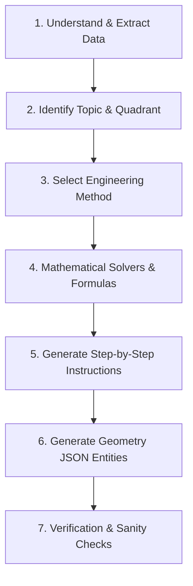

# 07. REASONING ENGINE — 7-Stage Execution Pipeline

The AI engine must NEVER jump straight to drawing lines. It MUST execute this deterministic 7-stage pipeline:

---

## 1. PIPELINE STAGES

---

## 2. DETAILED STAGE BREAKDOWN

### Stage 1: Extraction & Parsing
- Extract explicit parameters from user prompt text.
- Example: `"Line AB 90mm long..."` $\rightarrow TL = 90\text{ mm}$.
- `"End A is 20mm above HP and 30mm in front of VP..."` $\rightarrow h_a = 20\text{ mm}, d_a = 30\text{ mm}$.
- `"Inclined at 30° to HP and 40° to VP..."` $\rightarrow \theta = 30^\circ, \phi = 40^\circ$.

### Stage 2: Quadrant Determination
- Height above HP ($h_a > 0$) AND Distance in front of VP ($d_a > 0$) $\rightarrow$ **1st Quadrant**.
- Front view $a'$ is $+20\text{ mm}$ (above $XY$). Top view $a$ is $-30\text{ mm}$ (below $XY$).

### Stage 3: Engineering Method Selection
- Select **Rotation Method** (Standard BIS textbook construction).

### Stage 4: Trigonometric Computations
- Front View Apparent Length $a'b' = TL \cdot \cos\phi = 90 \cdot \cos(40^\circ) = 68.94\text{ mm}$.
- Top View Apparent Length $ab = TL \cdot \cos\theta = 90 \cdot \cos(30^\circ) = 77.94\text{ mm}$.
- Height of locus of $b'$ above $XY$: $h_b = h_a + TL \cdot \sin\theta = 20 + 90 \cdot \sin(30^\circ) = 65.00\text{ mm}$.
- Depth of locus of $b$ below $XY$: $d_b = d_a + TL \cdot \sin\phi = 30 + 90 \cdot \sin(40^\circ) = 87.85\text{ mm}$.
- Lateral Offset between projectors: $x_b = \sqrt{(a'b')^2 - (h_b - h_a)^2} = \sqrt{68.94^2 - 45^2} = 52.26\text{ mm}$.
- Apparent inclination to HP ($\alpha$): $\tan\alpha = \frac{h_b - h_a}{x_b} \implies \alpha = \arctan\left(\frac{45}{52.26}\right) = 40.73^\circ$.
- Apparent inclination to VP ($\beta$): $\tan\beta = \frac{d_b - d_a}{x_b} \implies \beta = \arctan\left(\frac{57.85}{52.26}\right) = 47.90^\circ$.

### Stage 5: Construction Steps
Generate atomic instructions (Steps 1 to 8) matching the geometric progression.

### Stage 6: Geometry Entities Generation
Generate explicit coordinates for $a', a, b_1', b_1, b_2, b', b, \text{loci}, \text{projectors}, \text{arcs}$.

### Stage 7: Geometry Verification
Check if $x_{b'} == x_b$ (Vertical projector alignment constraint).
